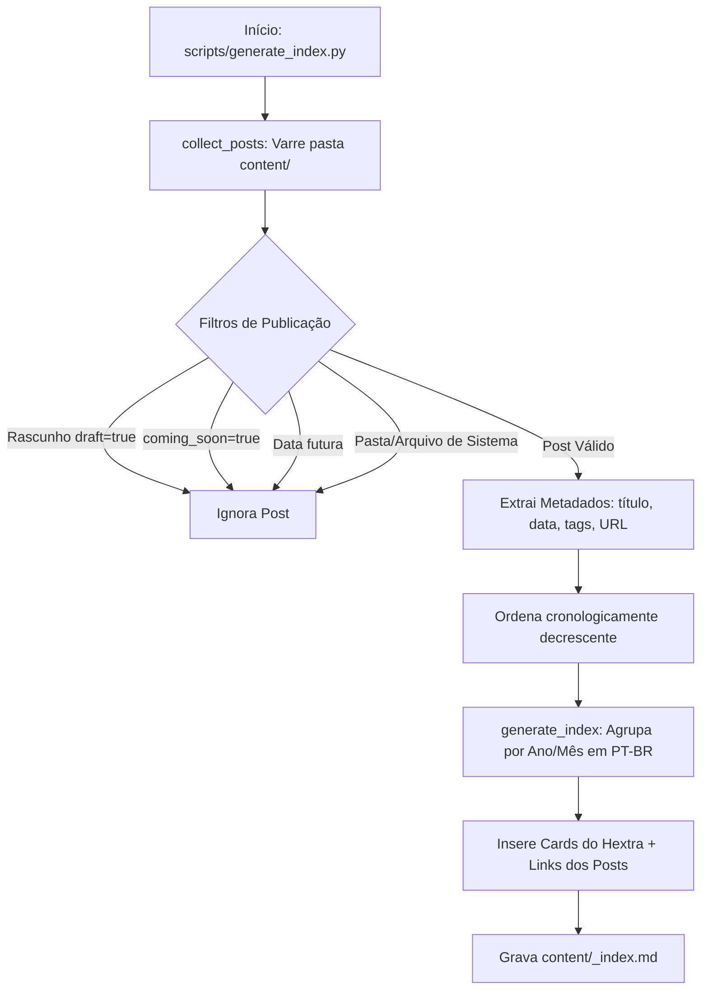

Este documento detalha o funcionamento, a arquitetura e a integração do script de automação [`scripts/generate_index.py`](https://github.com/joaopedro-chaves/joaopedro-chaves.github.io/blob/main/scripts/generate_index.py), responsável por catalogar as publicações do site e gerar dinamicamente o índice principal em Markdown (`content/_index.md`).

---

## 1. Visão Geral

O site é gerado pelo [Hugo](https://gohugo.io/) com o tema [Hextra](https://github.com/imfing/hextra). Em vez de manter manualmente a lista de publicações e artigos atualizados na página inicial, o projeto conta com um script em Python puro (sem dependências externas) que:

1. Varre todo o diretório `content/` em busca de arquivos Markdown.
2. Analisa o cabeçalho (_Frontmatter_) de cada arquivo.
3. Filtra rascunhos, posts com datas futuras e páginas especiais.
4. Agrupa os conteúdos cronologicamente por **Ano e Mês** (em português do Brasil).
5. Gera automaticamente o arquivo `content/_index.md` contendo os _Cards_ de navegação e a listagem com links, datas e tags.

---

## 2. Como Executar

### Pré-requisitos

- **Python 3.8+** instalado.
- Nenhuma biblioteca de terceiros é necessária (utiliza apenas a biblioteca padrão: `os`, `re`, `datetime`, `collections`).

### Execução Local

Na raiz do repositório, execute:

```bash
python3 scripts/generate_index.py
```

### Saída Esperada no Terminal

```text
Scanning content directory...
Found 4 published post(s)
Main index generated: /home/radiant/DevHub/joaopedro-chaves.github.io/content/_index.md
```

Após a execução, o arquivo `content/_index.md` estará atualizado e o servidor local do Hugo (`dev.sh` ou `hugo server`) refletirá as mudanças instantaneamente.

---

## 3. Fluxo de Execução e Arquitetura

O script segue um pipeline linear e modular dividido nas seguintes etapas:



### 3.1. Varredura e Coleta (`collect_posts`)

A função percorre recursivamente o diretório `content/` via `os.walk`, aplicando regras de exclusão:

- **Pastas ignoradas**: `.git`, `public`, `themes`, `static`, `assets`.
- **Arquivos ignorados**: `_index.md` (para evitar recursão) e `about.md`.

### 3.2. Leitura do Frontmatter (`parse_frontmatter`)

O script lê os delimitadores `---` do YAML usando expressões regulares (`re`), evitando a dependência de pacotes externos como `pyyaml`:

- Mapeia chaves simples como `title`, `date`, `draft` e `coming_soon`.
- **Suporte a Tags**: Trata tanto listas inline no formato `tags: ["tag1", "tag2"]` quanto listas em bloco com marcadores `- tag`.

### 3.3. Tratamento de Datas (`parse_date`)

A função é resiliente a múltiplos formatos de data:

- `YYYY-MM-DDTHH:MM:SSZ` (ISO com UTC)
- `YYYY-MM-DDTHH:MM:SS-03:00` (ISO com fuso horário / timezone offset)
- `YYYY-MM-DD` (data simples)
  Todas as datas são normalizadas para objetos `datetime` com fuso horário ciente (_timezone-aware_) para comparação segura com o horário atual.

### 3.4. Regras de Filtragem

O post só é incluído na página inicial se atender aos seguintes critérios:

- `draft` **não** é `true`.
- `coming_soon` **não** é `true`.
- A data da publicação **não** é futura em relação ao momento da execução.

### 3.5. Formatação do Markdown (`generate_index`)

1. Gera o frontmatter da homepage com o timestamp da compilação:
   ```yaml
   ---
   date: "2026-09-03T22:39:58Z"
   draft: false
   cascade:
     type:
   ---
   ```
2. Insere os blocos de cartões interativos do Hextra:
   ```html
        
   ```
3. Agrupa as postagens por mês em português brasileiro (ex.: `Agosto 2026`).
4. Constrói as entradas com o título vinculado à URL do Hugo, data formatada (`DD/MM/AAAA`) e badges formatadas em código para as tags:
   ```markdown
   - [Título do Post](/caminho/do/post/) _(26/08/2026)_ — `tag1`, `tag2`
   ```

---

## 4. Integração Contínua (CI/CD com GitHub Actions)

O script está integrado ao fluxo de publicação do GitHub Pages através do arquivo [`.github/workflows/pages.yaml`](https://github.com/joaopedro-chaves/joaopedro-chaves.github.io/blob/main/.github/workflows/pages.yaml).

A cada `git push` na branch `main`:

1. O job `update-index` inicializa o ambiente com Python.
2. O comando `python scripts/generate_index.py` é executado.
3. Se houver alterações no `content/_index.md`, a ação realiza automaticamente um commit com a mensagem:
   ```text
   chore: auto-update index pages [skip ci]
   ```
4. Em seguida, o job de build do Hugo empacota o site com a lista 100% atualizada e faz o deploy no GitHub Pages.

---

## 5. Guia para Autores de Conteúdo

Ao criar um novo post ou documento em `content/blog/`, `content/docs/` ou `content/projects/`, certifique-se de preencher o cabeçalho corretamente para que ele seja indexado automaticamente:

```yaml
---
title: "Título do Seu Artigo"
description: "Breve resumo sobre o conteúdo."
date: "2026-08-27T14:22:32Z"
tags: ["python", "automacao", "hugo"]
draft: false
---
```

> [!TIP]
> Caso queira preparar um artigo antecipadamente sem que ele apareça na página inicial, defina `draft: true` ou configure a data para um momento futuro. Ele só entrará no índice quando o rascunho for desativado e a data atingida.
